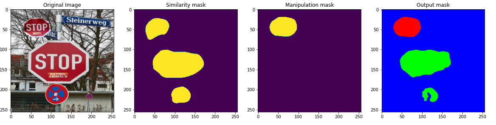
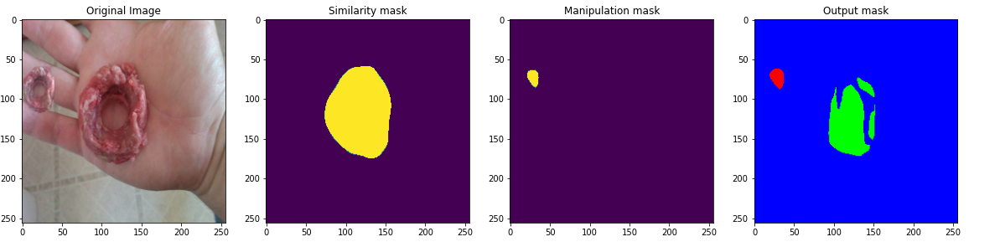
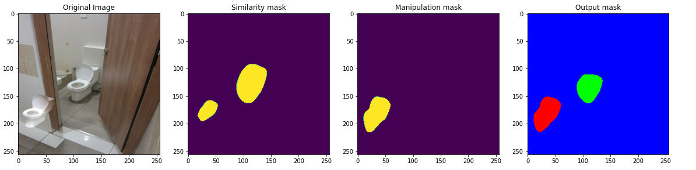

# BusterNet_pytorch: Detecting Copy-Move Image Forgery with Source/Target Localization

### Introduction
I reimplement a novel deep neural architecture for image copy-move forgery detection (CMFD), code-named *BusterNet*.

In this repository, we release many paper related things, including

- a pretrained BusterNet model (trained model at epoch 13)
- custom layers implemented in pytorch
- python demo notebook


### Example





### Dataset
USCISI-CMFD Dataset

#### Introduction
This copy-move forgery detection(CMFD) dataset relies on
- [MIT SUN2012 Database](https://groups.csail.mit.edu/vision/SUN/)
- [MS COCO Dataset](http://cocodataset.org/#home)

More precisely, we synthesize a copy-move forgery sample using the following steps

1. select a sample in the two above dataset
2. select one of its object polygon
3. use both sample image and polgyon mask to synthesize a sample

More detailed description can be found in paper. 

#### Folder Content
This USCISI-CMFD dataset folder contains the following things:

* **api.py** - USCISI-CMFD dataset API
* **USCISI-CMFD Dataset** - USCISI-CMFD LMDB dataset 
  * Two versions are NOT included due to repo size limit. Please right click to download from the google drive.
    * [**USCISI-CMFD-Small**](https://drive.google.com/file/d/14WrmeVRTf9T0umSW6I267zBrsmCjCEIQ/view?usp=sharing) - 100 samples, ~40MB
    * [**USCISI-CMFD-Full**](https://drive.google.com/file/d/1gsx5c-oilsFEzX_j1zKTPP4yWEs6T385/view?usp=sharing) - 100K samples, ~100GB
  * After uncompressing the downloaded dataset, you should see the following files
    * **data.mdb** - sample LMDB data file
    * **samples.keys** - a file listing sample keys (each line is a key)
    * **lock.mdb** - sample LMDB locker file
* **Demo.ipynb** - a python notebook show the usage of API
* **ReadMe.md** - this file

**NOTE** due to the repository size limit, the full USCISI-CMFD dataset will be provided upon request.

### Training
1. Download dataset to folder 'datasets' with link about. The ownership belong to yue_wu[at]isi.edu, therefor if you dont have accept permission. Please to contact him.
  (Optional) Download pretrained VGG16 at [VGG16](https://download.pytorch.org/models/vgg16-397923af.pth)
2. Install independent package.
```pip install -r requirements.txt```
3. Training:
```python train.py```
with custom argurments:
```
usage: Buster Net [-h] [-n NUM_WORKERS] [-b BATCH_SIZE] [--num_gpus NUM_GPUS]
                  [--freeze_layers [FREEZE_LAYERS [FREEZE_LAYERS ...]]]
                  [--lr LR] [--optim OPTIM] [--num_epochs NUM_EPOCHS]
                  [--val_interval VAL_INTERVAL]
                  [--save_interval SAVE_INTERVAL]
                  [--es_min_delta ES_MIN_DELTA] [--es_patience ES_PATIENCE]
                  [--lmdb_dir LMDB_DIR] [--log_path LOG_PATH]
                  [-w LOAD_WEIGHTS] [--saved_path SAVED_PATH]
```
4. Try predict in demo.ipynb

### Citation
If you use the provided code or data in any publication, please kindly cite the following paper.

    @inproceedings{wu2018eccv,
      title={BusterNet: Detecting Image Copy-Move Forgery With Source/Target Localization},
      author={Wu, Yue, and AbdAlmageed, Wael and Natarajan, Prem},
      booktitle={European Conference on Computer Vision (ECCV)},
      year={2018},
      organization={Springer},
    }
    
### Contact
- Name: Nguyen Thanh Dat
- Email: ntdat017\[at\]gmail.com


### License
The Software is made available for academic or non-commercial purposes only. The license is for a copy of the program for an unlimited term. Individuals requesting a license for commercial use must pay for a commercial license. 

      USC Stevens Institute for Innovation 
      University of Southern California 
      1150 S. Olive Street, Suite 2300 
      Los Angeles, CA 90115, USA 
      ATTN: Accounting 

DISCLAIMER. USC MAKES NO EXPRESS OR IMPLIED WARRANTIES, EITHER IN FACT OR BY OPERATION OF LAW, BY STATUTE OR OTHERWISE, AND USC SPECIFICALLY AND EXPRESSLY DISCLAIMS ANY EXPRESS OR IMPLIED WARRANTY OF MERCHANTABILITY OR FITNESS FOR A PARTICULAR PURPOSE, VALIDITY OF THE SOFTWARE OR ANY OTHER INTELLECTUAL PROPERTY RIGHTS OR NON-INFRINGEMENT OF THE INTELLECTUAL PROPERTY OR OTHER RIGHTS OF ANY THIRD PARTY. SOFTWARE IS MADE AVAILABLE AS-IS. LIMITATION OF LIABILITY. TO THE MAXIMUM EXTENT PERMITTED BY LAW, IN NO EVENT WILL USC BE LIABLE TO ANY USER OF THIS CODE FOR ANY INCIDENTAL, CONSEQUENTIAL, EXEMPLARY OR PUNITIVE DAMAGES OF ANY KIND, LOST GOODWILL, LOST PROFITS, LOST BUSINESS AND/OR ANY INDIRECT ECONOMIC DAMAGES WHATSOEVER, REGARDLESS OF WHETHER SUCH DAMAGES ARISE FROM CLAIMS BASED UPON CONTRACT, NEGLIGENCE, TORT (INCLUDING STRICT LIABILITY OR OTHER LEGAL THEORY), A BREACH OF ANY WARRANTY OR TERM OF THIS AGREEMENT, AND REGARDLESS OF WHETHER USC WAS ADVISED OR HAD REASON TO KNOW OF THE POSSIBILITY OF INCURRING SUCH DAMAGES IN ADVANCE. 

For commercial license pricing and annual commercial update and support pricing, please contact: 

      Rakesh Pandit USC Stevens Institute for Innovation 
      University of Southern California 
      1150 S. Olive Street, Suite 2300
      Los Angeles, CA 90115, USA 

      Tel: +1 213-821-3552
      Fax: +1 213-821-5001 
      Email: rakeshvp@usc.edu and ccto: accounting@stevens.usc.edu


